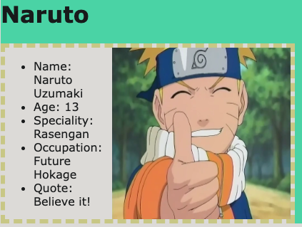

# Rick and Morty Bio

We are huge fans of Rick and Morty and we would like to make a biography website about the characters. We want the background color and the font family to be a certain way. There are a few span tags within each li, can we add the facts about each character in the unordered list. We would like to an image of a character on the page by setting the src attribute to the relative path in order to show the image. Also set the width attribute to 200px. You can append the image into the card and have it be to the right of the bio underordered list.

## Information needed for this assignment

### Character 1
- name: Rick Sanchez
- age: 70
- occupation: Scientist
- quote: Wubba lubba dub-dub!
- background-color: #42f5b9
- font-family: Verdana, Geneva, Tahoma, sans-serif
- image can be found inside of the image folder

### Character 2
- name: Morty Smith
- age: 14
- occupation: Student
- quote: Hi Mr. Jellybean, I’m Morty. I’m on an adventure with my grandpa.
- background-color: #e57bc8
- font-family: Verdana, Geneva, Tahoma, sans-serif
- image can be found inside of the image folder

### Character 3
- name: Beth Smith
- age: 35
- occupation: Horse Surgeon
- quote: Don’t deify the people who leave you.
- background-color: #2596be
- font-family: Verdana, Geneva, Tahoma, sans-serif
- image can be found inside of the image folder

### Character 4
- name: Summer Smith
- age: 17
- occupation: Student
- quote: You’re the little brother. You’re not the cause of your parents’ misery, you’re just a symptom of it.
- background-color: #8e74bc
- font-family: Verdana, Geneva, Tahoma, sans-serif
- image can be found inside of the image folder
